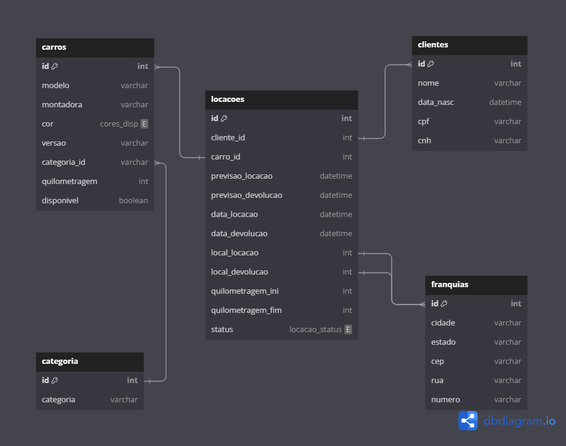

# Banco de dados - CarLoca

## Projeto
Banco de dados de uma locadora de carros desenvolvido em linguagem SQL.
O banco permite o cadastro de clientes, carros, categorias de carros, franquias da locadora e locações

## Tabelas

- CARROS
    - ID
    - MODELO
    - MONTADORA
    - COR
    - VERSÃO
    - CATEGORIA_ID
    - QUILOMETRAGEM
    - DISPONIVEL

- CATEGORIAS
    - ID
    - CATEGORIA

- CLIENTES
    - ID
    - NOME
    - DATA_NASC
    - CPF
    - CNH

- FRANQUIAS
    - ID
    - CIDADE
    - ESTADO
    - CEP
    - RUA
    - NUMERO

- LOCAÇÕES
    - ID
    - CLIENTE_ID
    - CARRO_ID
    - PREVISAO_LOCACAO
    - PREVISAO_DEVOLUCAO
    - DATA_LOCACAO
    - DATA_DEVOLUCAO
    - LOCAL_LOCACAO
    - LOCAL_DEVOLUCAO
    - QUILOMETRAGEM_INI
    - QUILOMETRAGEM_FIN
    - STATUS

## DIAGRAMA ENTIDADE RELACIONAMENTO (DER)
Representação da modelagem do banco de dados CarLoca

O DER também pode ser visitado no link:
https://dbdiagram.io/d/CARLOCA-6584ec4d89dea62799626bde

## FUNCIONALIDADES DO PROJETO Um carro possui modelo montadora, cor e versão; 

    - [ ] As cores de carro disponiveis são apenas branco, preto e prata;
    - [ ] Existem várias categorias de veiculos (como: Hatch, Sedam,  SUV);
    - [ ] Um cliente pode alugar um carro somente na modalidade "diária";
    - [ ] Um cliente não pode alugar mais de um carro;
    - [ ] Enquanto um carro estiver locado por um cliente não pode ser ofetado para outro;
    - [ ] O sistema deve manter o histórico dos clientes que locaram determinado carro;
    - [ ] O sistema deve manter o histórico de quantos quilometros o cliente rodou com o carro bem como a quilometragem atual de cada um dos carros;
    - [ ] O sistema deve saber onde o carro foi locado e onde foi devolvido cada veículo.
    - [ ] Devem ser gerados inserts e selects que possibilitem validar cada um dos requisitos acima.
    - [ ] O exercicio deve ser desenvolvido considerando todos os principios de normalização de dados.

## INSTRUÇÕES
- O arquivo `create_carloca.sql` possui os comandos necessários para criar as tabelas no banco de dados.
- O arquivo `popular_carloca.sql` possui os comandos para popular as tabelas do banco de dados.
- O arquivo `queries_carloca.sql` possui algumas queries para validar o funcionamento do banco de dados. 